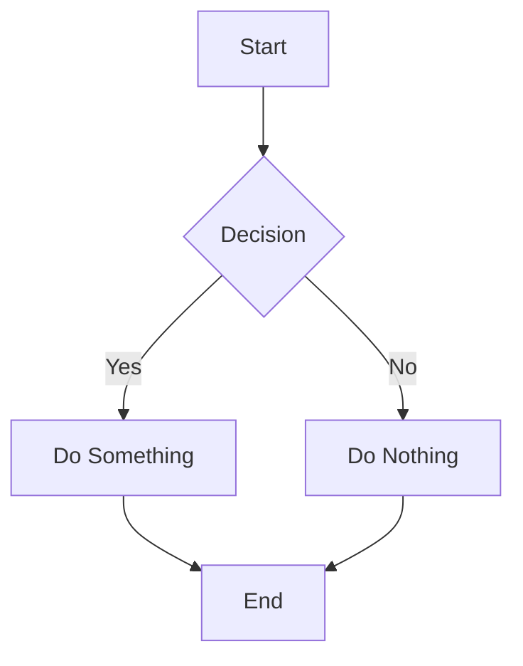
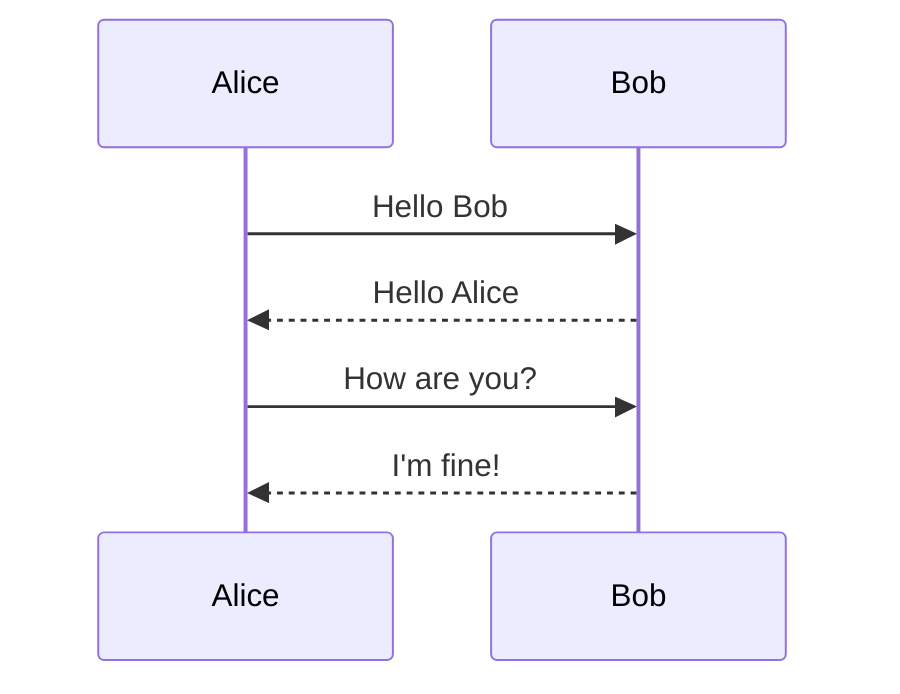
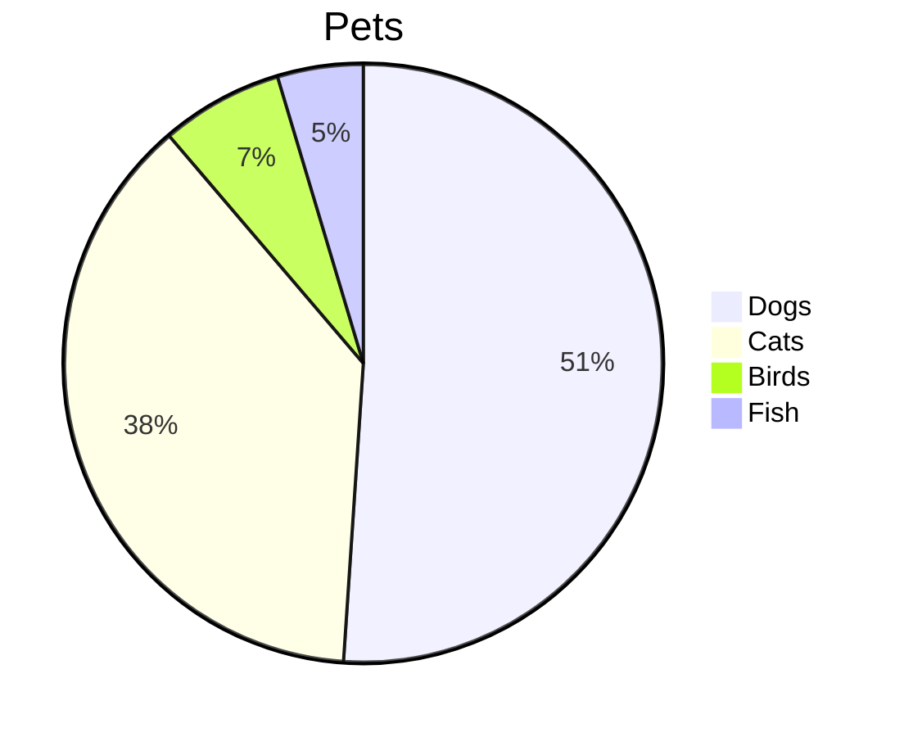

# Comprehensive Markdown Sample - Syntax Highlighting Demonstration

This file demonstrates all major Markdown language features for syntax highlighting purposes.

---

## Headers

# H1 Header
## H2 Header
### H3 Header
#### H4 Header
##### H5 Header
###### H6 Header

Alternative H1
==============

Alternative H2
--------------

---

## Emphasis

*Italic text* or _also italic_

**Bold text** or __also bold__

***Bold and italic*** or ___also bold and italic___

~~Strikethrough text~~

==Highlighted text== (if supported)

Subscript: H~2~O (if supported)

Superscript: X^2^ (if supported)

---

## Lists

### Unordered Lists

- Item 1
- Item 2
  - Nested item 2a
  - Nested item 2b
    - Deep nested item
- Item 3

* Alternative bullet
* Another item

+ Plus sign bullet
+ Another item

### Ordered Lists

1. First item
2. Second item
   1. Nested item
   2. Another nested item
3. Third item

1. All items can use 1.
1. Markdown will number correctly
1. Automatically

### Task Lists

- [x] Completed task
- [ ] Incomplete task
- [x] Another completed task
  - [ ] Nested incomplete
  - [x] Nested complete

### Definition Lists (if supported)

Term 1
: Definition 1a
: Definition 1b

Term 2
: Definition 2

---

## Links

[Inline link](https://example.com)

[Link with title](https://example.com "Example Title")

[Reference link][ref1]

[Implicit reference link][]

[Numbered reference link][1]

Direct URL: <https://example.com>

Email: <email@example.com>

[ref1]: https://example.com "Reference 1"
[Implicit reference link]: https://example.com
[1]: https://example.com

### Anchor Links

[Jump to Headers](#headers)

[Jump to Code Blocks](#code-blocks)

---

## Images


![Reference image][img1]

[](https://example.com)

[img1]: https://via.placeholder.com/200 "Reference Image"

---

## Code

### Inline Code

Use `inline code` for short snippets.

Use backticks for `const variable = 'value';` inline.

### Code Blocks

```
Plain code block
without language specified
```

```javascript
// JavaScript code block
const greeting = 'Hello, World!';
function sayHello(name) {
    console.log(`Hello, ${name}!`);
    return true;
}
sayHello('Markdown');
```

```python
# Python code block
def factorial(n):
    """Calculate factorial of n."""
    if n <= 1:
        return 1
    return n * factorial(n - 1)

result = factorial(5)
print(f"5! = {result}")
```

```rust
// Rust code block
fn main() {
    let numbers = vec![1, 2, 3, 4, 5];
    let sum: i32 = numbers.iter().sum();
    println!("Sum: {}", sum);
}
```

```bash
#!/bin/bash
# Bash script
for i in {1..5}; do
    echo "Number: $i"
done
```

```sql
-- SQL query
SELECT u.name, COUNT(p.id) as post_count
FROM users u
LEFT JOIN posts p ON u.id = p.user_id
WHERE u.active = TRUE
GROUP BY u.id
HAVING COUNT(p.id) > 5
ORDER BY post_count DESC;
```

```json
{
  "name": "sample",
  "version": "1.0.0",
  "dependencies": {
    "markdown": "^2.0.0"
  }
}
```

```yaml
# YAML configuration
server:
  host: localhost
  port: 8080
  ssl:
    enabled: true
    certificate: /path/to/cert.pem
```

```diff
- Removed line
+ Added line
  Unchanged line
! Modified line
```

    Indented code block
    (4 spaces or 1 tab)
    function example() {
        return true;
    }

---

## Blockquotes

> Simple blockquote

> Multi-line blockquote
> continues on next line

> Blockquote with multiple paragraphs
>
> Second paragraph here

> Nested blockquote
>
>> Nested level 1
>>
>>> Nested level 2

> ### Blockquote with header
>
> - List item 1
> - List item 2
>
> **Bold text** in blockquote

---

## Tables

| Header 1 | Header 2 | Header 3 |
|----------|----------|----------|
| Cell 1   | Cell 2   | Cell 3   |
| Cell 4   | Cell 5   | Cell 6   |

### Aligned Tables

| Left | Center | Right |
|:-----|:------:|------:|
| L1   | C1     | R1    |
| L2   | C2     | R2    |
| L3   | C3     | R3    |

### Complex Table

| Feature | Basic | Pro | Enterprise |
|:--------|:-----:|:---:|:----------:|
| Users   | 5     | 50  | Unlimited  |
| Storage | 1 GB  | 10 GB | 100 GB   |
| Support | Email | Chat | 24/7 Phone |
| Price   | $0    | $10/mo | $100/mo |

---

## Horizontal Rules

Three or more hyphens:

---

Three or more asterisks:

***

Three or more underscores:

___

---

## HTML Elements

<div align="center">
  <strong>Centered bold text using HTML</strong>
</div>

<details>
<summary>Click to expand</summary>

This content is hidden by default.

- Item 1
- Item 2
- Item 3

</details>

<kbd>Ctrl</kbd> + <kbd>C</kbd> to copy

<sup>superscript</sup> and <sub>subscript</sub>

<mark>Highlighted text</mark>

<abbr title="HyperText Markup Language">HTML</abbr>

---

## Escape Characters

\*Not italic\*

\# Not a header

\[Not a link\](url)

\`Not code\`

\\Backslash\\

---

## Footnotes

Here's a sentence with a footnote[^1].

Multiple footnotes are supported[^2][^note].

[^1]: This is the first footnote.
[^2]: This is another footnote with multiple paragraphs.

    Indent paragraphs to include them in the footnote.

[^note]: Named footnote reference.

---

## Mathematics (LaTeX)

Inline math: $E = mc^2$

Display math:

$$
\frac{n!}{k!(n-k)!} = \binom{n}{k}
$$

$$
\sum_{i=1}^{n} i = \frac{n(n+1)}{2}
$$

$$
\int_0^\infty e^{-x^2} dx = \frac{\sqrt{\pi}}{2}
$$

---

## Diagrams (Mermaid)







---

## Alerts/Admonitions (GitHub style)

> [!NOTE]
> This is a note admonition.

> [!TIP]
> This is a tip admonition.

> [!IMPORTANT]
> This is an important admonition.

> [!WARNING]
> This is a warning admonition.

> [!CAUTION]
> This is a caution admonition.

---

## Emoji

:smile: :heart: :thumbsup: :rocket: :star:

:warning: :x: :white_check_mark: :bulb: :memo:

Unicode emoji: 🚀 ⭐ ❤️ 👍 😊

---

## Special Characters

- Ampersand: &
- Less than: <
- Greater than: >
- Copyright: ©
- Registered: ®
- Trademark: ™
- Em dash: —
- En dash: –
- Ellipsis: …

---

## Abbreviations

*[HTML]: HyperText Markup Language
*[CSS]: Cascading Style Sheets
*[JS]: JavaScript

The HTML specification is maintained by the W3C.
CSS and JS are used for styling and interactivity.

---

## Table of Contents (Manual)

1. [Headers](#headers)
2. [Emphasis](#emphasis)
3. [Lists](#lists)
4. [Links](#links)
5. [Images](#images)
6. [Code](#code)
7. [Blockquotes](#blockquotes)
8. [Tables](#tables)
9. [HTML Elements](#html-elements)
10. [Mathematics](#mathematics-latex)

---

## Comments

[//]: # (This is a comment and won't be rendered)

[comment]: <> (Another comment syntax)

<!-- HTML comment -->

---

## Front Matter (YAML)

```yaml
---
title: "Sample Document"
author: "John Doe"
date: 2024-01-15
tags:
  - markdown
  - sample
  - documentation
draft: false
---
```

---

## References

This document follows the [CommonMark Specification](https://commonmark.org/) and includes extensions from [GitHub Flavored Markdown](https://github.github.com/gfm/).

---

*End of Markdown Sample*
